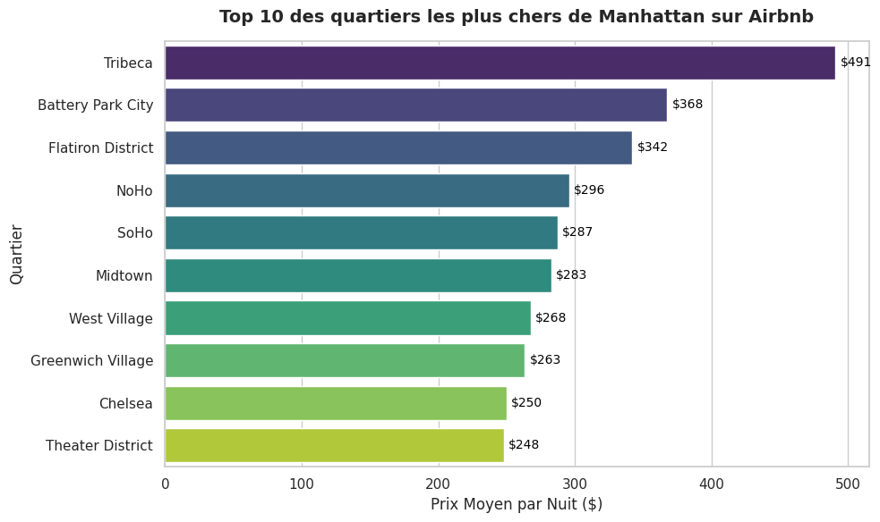
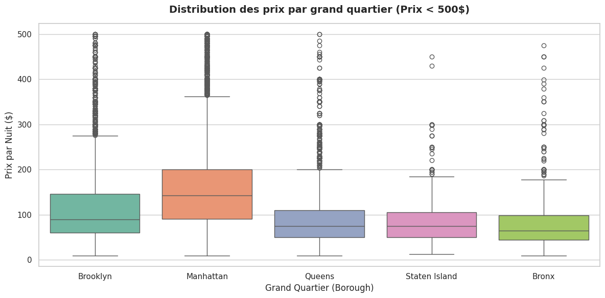

# 🗽 Exploratory Data Analysis : Marché Airbnb à New York

## 📌 Contexte du Projet
Ce projet a pour objectif d'analyser le marché des locations Airbnb à New York (2019) afin d'en extraire des insights métiers. L'analyse se concentre sur l'extraction des données, le nettoyage (Data Cleaning), la manipulation avancée via SQL et la visualisation des résultats.

## 🛠️ Outils et Technologies utilisés
* **Langage :** Python
* **Manipulation de données :** Pandas
* **Base de données & Requêtage :** SQL (via `sqlite3`, requêtes complexes avec `CASE WHEN`, `GROUP BY`, `HAVING`)
* **Data Visualization :** Matplotlib, Seaborn

## ⚙️ Méthodologie
1. **ETL (Extract, Transform, Load) :** Importation des données brutes via URL.
2. **Data Cleaning :** Traitement des valeurs manquantes et filtrage des anomalies (prix à 0$).
3. **Analyse SQL :** Création d'une base de données locale pour interroger les données. Création de catégories de prix (Budget, Standard, Luxe) via des instructions conditionnelles.
4. **Data Storytelling :** Création de graphiques statistiques (Barplots, Boxplots) pour mettre en évidence la distribution des prix.

## 📊 Extraits des Résultats

### 1. Le Top 10 des quartiers les plus chers (Manhattan)
L'analyse SQL couplée à Seaborn révèle que **Tribeca** domine largement le marché avec un prix moyen de près de 491$ par nuit, suivi par *Battery Park City*.

### 2. Distribution des prix par Borough
L'utilisation de diagrammes en boîte (Boxplots) permet de visualiser la dispersion des prix et de confirmer que Manhattan concentre la majorité des logements d'exception, tandis que les autres quartiers offrent des prix plus resserrés et abordables.

> **Note :** Le code complet, détaillé et commenté de l'analyse est disponible dans le fichier `Analyse_Airbnb_NYC.ipynb` de ce dépôt.
